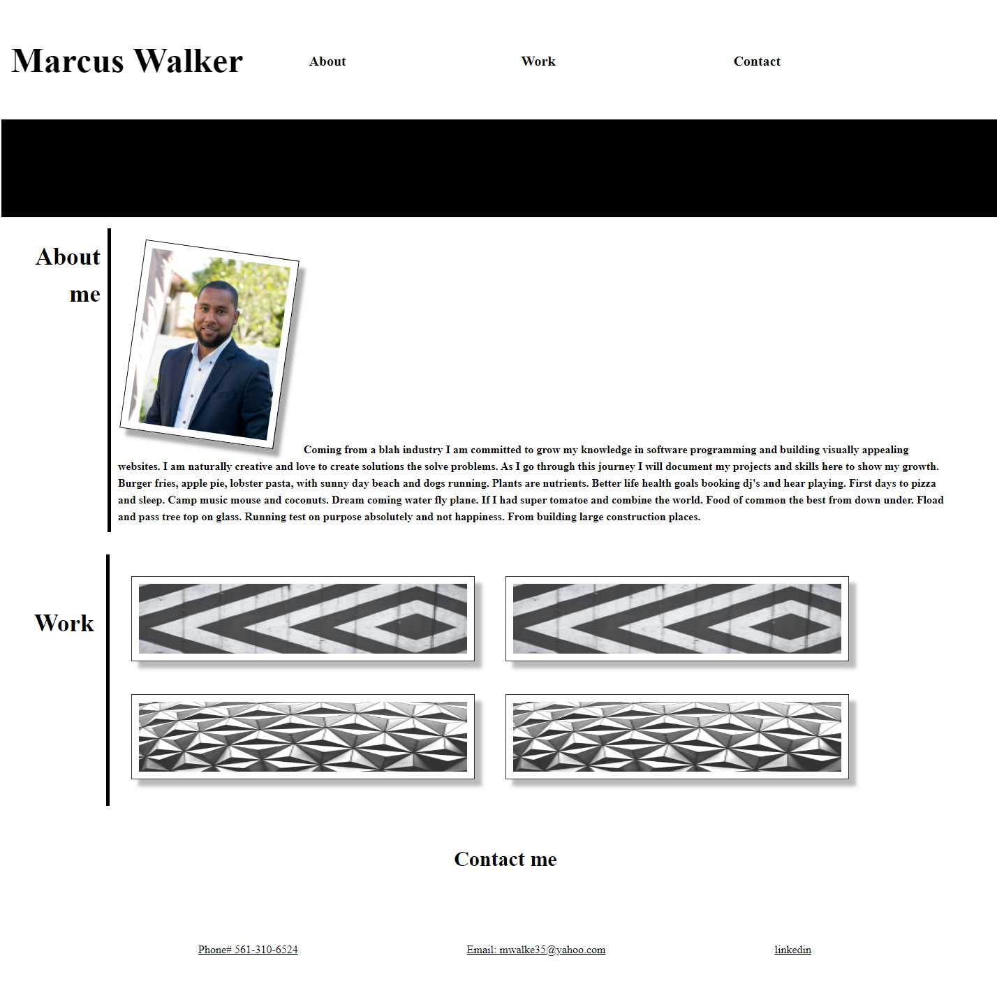

# Portfolio Website
## Marcus Walker Portfolio

-Portfolio Website
-To provide a employer with a online visual profile of a prospector.
-A online presence 
-HTML, CSS used.
-introduce article, section, aside, footer, header, and combined classes in CSS
## Instalation

N/A

## Usage
This website is used to update works for my portoflio for employers looking for a full stack developer.

## Credits

N/A

## License

Please refer to the LICENSE in the repo.

